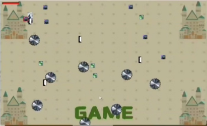
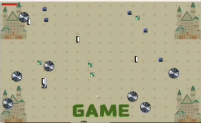
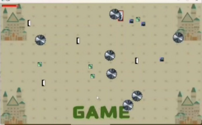
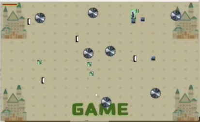

# 刀来 —— 基于 C++ / Qt 的 2D 实时动作游戏

## 项目简介

**“刀来”** 是一款基于 Qt 桌面 GUI 框架实现的轻量级 2D 实时动作游戏。

游戏采用实时更新机制，玩家通过键盘控制角色移动、攻击和加速，在动态场景中与敌对目标进行战斗。场景中同时包含障碍物、回血点和成对传送门等交互元素，使游戏过程具有一定的随机性和策略性。

项目使用 Qt Widgets 构建游戏界面，并通过 `QPainter` 完成游戏对象的绘制，通过 `QTimer` 驱动游戏状态的周期性更新，实现约 60 FPS 的实时游戏循环。

## 功能特性

* **角色移动**

  * 使用方向键控制角色在游戏场景中移动。
  * 游戏窗口固定为 `1000 × 600`。

* **实时攻击**

  * 按下 `Space` 键进行攻击。
  * 根据角色攻击范围检测与敌对目标的碰撞。
  * 命中目标后减少其生命值，目标生命值归零后从场景中移除。

* **加速机制**

  * 按下 `Shift` 键进入加速状态。
  * 角色在正常移动速度和加速移动速度之间切换。

* **敌对目标**

  * 场景中随机生成多个目标。
  * 目标具有独立生命值和移动方向。
  * 目标会在游戏过程中自主移动，增加战斗的不确定性。

* **障碍物**

  * 场景中随机生成障碍物。
  * 角色与障碍物发生碰撞时会受到伤害。

* **回血点**

  * 角色碰到回血点后恢复生命值。
  * 已被使用的回血点从场景中移除。

* **传送门**

  * 场景中生成成对的传送门。
  * 角色进入传送门后会被传送至对应的另一扇传送门。

* **受击反馈**

  * 角色受到攻击后显示受击状态。
  * 通过短时间的闪烁效果提供视觉反馈。

* **游戏状态控制**

  * 角色生命值降至 0 时游戏失败。
  * 所有敌对目标被消灭后游戏结束并判定为胜利。
  * 游戏结束后进入结果界面，可返回欢迎界面重新开始游戏。

## 操作方式

| 操作      | 功能   |
| ------- | ---- |
| `↑`     | 向上移动 |
| `↓`     | 向下移动 |
| `←`     | 向左移动 |
| `→`     | 向右移动 |
| `Space` | 攻击   |
| `Shift` | 加速   |

## 技术实现

### 1. Qt Widgets 图形界面

项目基于 Qt Widgets 构建桌面 GUI，通过多个 Widget 组织游戏流程：

```text
WelcomeWidget
      │
      │ Start
      ▼
GameWidget
      │
      │ Game Over / Victory
      ▼
ResultWidget
      │
      │ Return
      └──────────────► WelcomeWidget
```

其中：

* `WelcomeWidget`：负责游戏欢迎界面和开始游戏操作。
* `GameWidget`：负责游戏场景、角色控制、游戏对象更新、碰撞检测以及游戏状态管理。
* `ResultWidget`：负责显示游戏结束后的胜负结果，并提供返回功能。

### 2. 实时游戏循环

使用 `QTimer` 周期性调用游戏更新逻辑：

```cpp
timer->start(16);
```

通过约 16 ms 的更新周期驱动游戏状态变化，对应理论上约 60 FPS 的更新频率。

每次更新主要完成：

1. 更新角色和游戏元素状态；
2. 移动动态游戏对象；
3. 检测游戏对象之间的碰撞；
4. 更新生命值及其他交互状态；
5. 判断游戏是否结束；
6. 请求重新绘制游戏场景。

### 3. 面向对象的游戏对象设计

项目将不同类型的游戏元素抽象为独立对象，包括：

```text
Character
Target
Obstacle
HealingPoint
Portal
```

不同对象分别维护自身的位置、属性和行为，使游戏场景中的角色和元素具有相对独立的状态管理。

其中 `Portal` 还维护配对传送门的引用，用于实现两个传送点之间的位置传递。

### 4. 矩形碰撞检测

游戏中的碰撞检测主要基于 Qt 提供的 `QRectF` 实现。

通过分别获取两个游戏对象的矩形区域，并使用：

```cpp
QRectF::intersects()
```

判断两个矩形是否发生交叠。

这种方法实现简单、计算开销较低，对于当前游戏规模能够满足实时交互的需求。

碰撞检测主要应用于：

* 角色与敌对目标；
* 角色与障碍物；
* 角色与回血点；
* 角色与传送门；
* 角色攻击范围与敌对目标。

### 5. 随机化场景

游戏开始时，会通过随机数生成不同游戏对象的初始位置和部分属性。

例如：

```cpp
rand() % range + offset
```

用于在指定范围内生成随机坐标；动态对象的移动方向也通过随机值进行初始化。

因此每次重新开始游戏时，敌人、障碍物、回血点和传送门的位置并不完全相同，从而提高游戏过程的随机性。

### 6. Qt Resource System

游戏所使用的背景、角色和场景元素图片通过 Qt Resource System 统一管理，并在 `resources.qrc` 中进行配置。

主要资源包括：

```text
character.png
target.png
obstacle.png
healing_point.png
portal.png
background.png
wel_background.png
win_background.png
lose_background.png
plus_icon.png
```

这样可以避免运行时依赖外部资源路径，使项目在正确构建后能够更加稳定地加载游戏资源。

## 项目结构

当前项目保持较为简单的 Qt Widgets / qmake 项目结构：

```text
Qtgame-edi-1/
├── images/
│   ├── background.png
│   ├── character.png
│   ├── healing_point.png
│   ├── lose_background.png
│   ├── obstacle.png
│   ├── plus_icon.png
│   ├── portal.png
│   ├── target.png
│   ├── wel_background.png
│   ├── win_background.png
│   ├── show1.png
│   ├── show2.png
│   ├── show3.png
│   └── show4.png
│
├── gamewidget.cpp
├── gamewidget.h
├── main.cpp
├── mainwindow.cpp
├── mainwindow.h
├── mainwindow.ui
├── resources.qrc
├── resultwidget.cpp
├── resultwidget.h
├── welcomewidget.cpp
├── welcomewidget.h
├── try8.pro
├── .gitignore
├── LICENSE
└── README.md
```

核心代码职责：

| 文件                | 主要职责                |
| ----------------- | ------------------- |
| `main.cpp`        | 程序入口及界面流程初始化        |
| `mainwindow.*`    | 主窗口及 Qt Designer UI |
| `welcomewidget.*` | 欢迎界面                |
| `gamewidget.*`    | 游戏核心逻辑与场景绘制         |
| `resultwidget.*`  | 游戏结束及结果界面           |
| `resources.qrc`   | 游戏资源管理              |
| `images/`         | 游戏图片资源              |

## 构建与运行

### 环境要求

* **Qt 6**
* **Qt Creator 15.0.1** 或兼容版本
* 支持 C++ 的 Qt 编译器工具链
* qmake

项目使用 `.pro` 文件进行构建，不依赖额外的第三方 C++ 库。

### 使用 Qt Creator

1. 克隆本仓库：

```bash
git clone https://github.com/Shaymus-G/Qtgame-edi-1.git
```

2. 使用 Qt Creator 打开：

```text
try8.pro
```

3. 选择可用的 Qt Kit。

4. 构建项目。

5. 运行程序。

> 项目中的 `*.pro.user` 和 `build/` 等 Qt Creator 用户配置及构建产物不会作为项目源码提交。

## 游戏效果展示

### 游戏主界面



### 传送门效果



### 角色受击效果



### 角色回血效果



## 测试

项目针对主要游戏交互效果进行了功能测试，包括：

* 敌对目标受击效果；
* 角色受击效果；
* 角色回血效果；
* 传送门传送效果；
* 角色移动与攻击；
* 游戏胜负状态判断；
* 欢迎界面与游戏界面切换；
* 游戏结果界面与重新开始流程。

目前项目的测试以功能验证和运行效果验证为主，后续重构阶段将进一步补充更加系统的单元测试。

## 开发与重构计划

该项目最初以课程大作业形式完成，早期代码主要围绕功能实现展开。后续计划在保持现有游戏玩法和视觉效果基本不变的情况下，对代码进行进一步工程化整理。

计划包括：

* 拆分 `GameWidget` 中不同游戏对象的实现；
* 独立管理 `Character`、`Target`、`Obstacle`、`HealingPoint` 和 `Portal`；
* 抽象游戏状态与状态切换逻辑；
* 优化碰撞检测相关代码；
* 改进随机场景生成逻辑；
* 增加更加系统的单元测试；
* 进一步完善项目文档和构建说明。

重构过程中将保留当前已经验证可以正常运行的版本作为稳定基线。

## 项目背景

本项目最初为南开大学《高级语言程序设计》课程大作业，开发过程中主要实践了：

* C++ 面向对象程序设计；
* Qt Widgets GUI 开发；
* Qt 事件处理机制；
* `QTimer` 实时更新；
* `QPainter` 图形绘制；
* 矩形碰撞检测；
* Qt Resource System；
* 游戏状态管理；
* 基于随机数的场景生成。

项目后续将从课程作业进一步整理为结构更加清晰、可维护性更好的个人 C++ / Qt 项目。

## License

本项目采用 [MIT License](LICENSE)。

如果仓库中的部分图片或其他资源并非由项目作者原创制作，则相关资源的版权和授权应以其原始来源的许可协议为准。